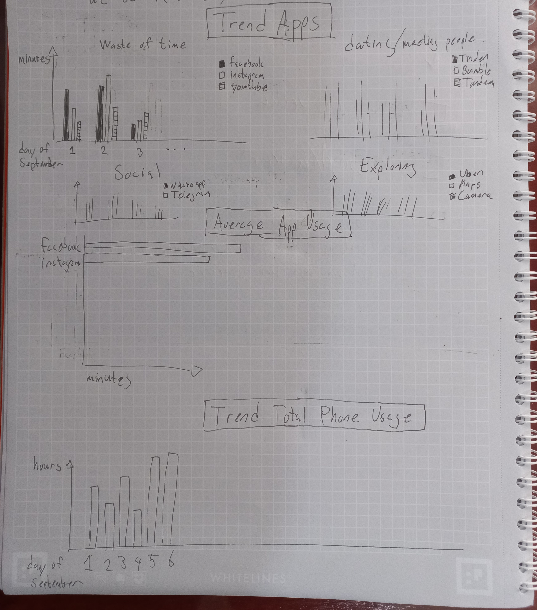

# Trabajo práctico: datos personales

## Idea
Visualizar cuanto tiempo gasto en diferentes aplicaciónes en mi celular en el mes de Septiembre usando la aplicación App Usage.

## Datos
Los datos vienen en csv y cuanton por cada día cuanto he usado una aplicación y cuantas veces lo he abierto. Ejemplo de csv:

```csv
"Summary","Usage time","","Checked phone",""
"9/5/21","9:48:26","+1%","76","-28%"
"Last 7 days","56:51:01","＋","660","＋"
"Last 7 days (average)","8:07:17","＋","110","＋"
"Last 30 days","56:51:01","＋","660","＋"
"Last 30 days (average)","1:53:42","＋","110","＋"
""
"Top apps","Usage time","","Access count",""
"Instagram","2:46:40","+20%","34","-45%"
"Edge","1:40:47","+49%","17","+21%"
"Tandem","1:14:56","-46%","29","-43%"
"Facebook","1:01:08","+231%","32","+191%"
"Bumble","0:59:20","-20%","41","-40%"
"Tinder","0:22:27","+16%","21","+17%"
"App Usage","0:22:03","＋","17","＋"
"WhatsApp","0:13:37","-57%","7","-84%"
"Messenger","0:12:17","-54%","6","-57%"
"Gallery","0:12:10","+317%","11","-15%"
""
"Daily usage digest, September 5, 2021"
"Created by App Usage (PRO) on Sunday, September 5, 2021, 10:05 PM"
```

## Ideas para la visualización de los datos
* **Trend Total Phone Usage:** Cuanto tiempo he usado mi celular en total cada día mediante un bar chart, un bar por día en orden cronológico.
* **Average App Usage:** El medio por Septiembre de cuanto he usado cada aplicación (minutos/día) con un bar chart, en orden del más usado al menos usado. El label seria el icono de la app con el nombre de la app. Será un horizontal bar chart (asi que los nombres de los apps tienen espacio).
* ~~El medio por día de cuantas veces he abierto cada aplicación.  El label seria el icono de la app con el nombre de la app.~~
* **Trend Apps:** Cuanto tiempo he usado diferentes aplicaciones cada día mediante bar charts: habrá cautros categorias como "Waste of time apps", "Dating apps", "Social apps" y "Exploration Apps" y cada categoria tendrá un plot. Cada plot mostrerá entre 3 y 5 apps en estilo "grouped bar chart". El eje x será día de Septiembre y eje y minutos.

Los bars tendran un color parecido a los colores de los apps.


